# How senior engineers think system design 

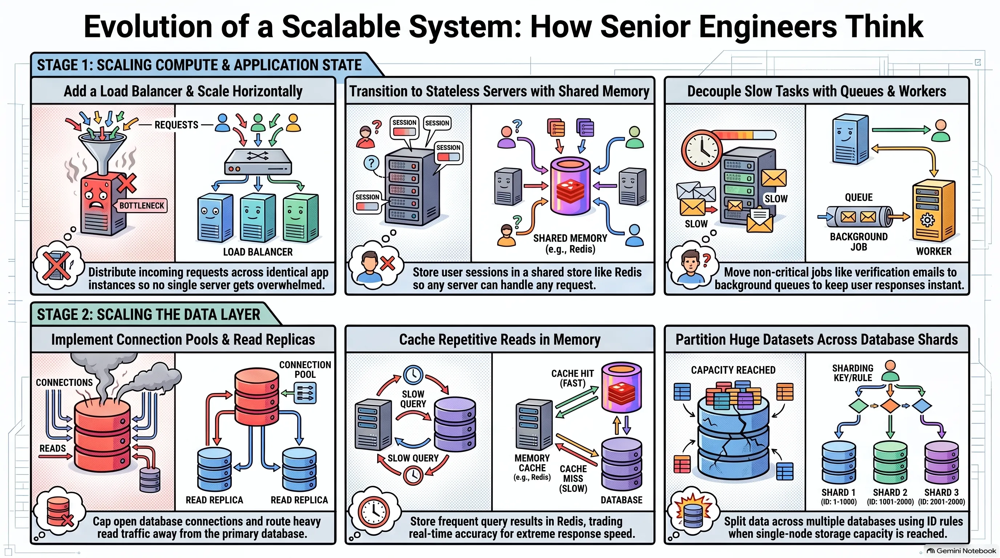

## What System Design Is

> This documentation will give you an evolutionary from scratch approach to understand system design, where, with the help of AI, we can make multiple apps with a frontend, backend, database, etc., and even deploy them online faster than ever. How to scale it? That problem is solved here. 

**Building an app is no longer the hard part.** Front end, backend, database, deployed, online. AI makes it faster than ever. The uncomfortable question: if anyone can build the app now, what makes you a good engineer?

- **Building the thing was never the hard part.** The hard part is what happens when the app gets popular.
  - One server isn't enough.
  - The database can't keep up.
  - It's slow and you don't know why.
- **That is system design.**
- **Most tutorials teach it wrong.** Load balancers, replicas, sharding, caching thrown at you all at once on day one, for an app that has 50 users.
- **This lesson does the opposite.**
  - Start with one server and one database, which is already enough for way more users than you think.
  - Break it on purpose, over and over.
  - Each time it breaks, fix exactly one thing.
  - By the end, you have built the whole system and you know why every piece is there and what it costs to add it.

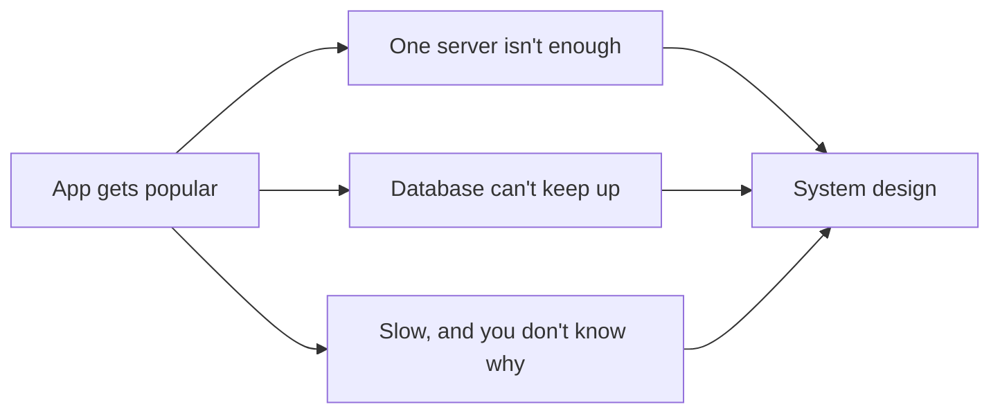

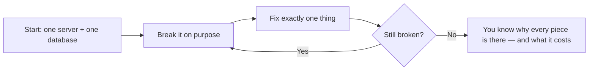

## The Starting Point: One Server, One Database

> Basic normal setup is server connected to database. Generic, not faulty, can cater to <10,000 total users and <200 concurrent users. But fails at very high traffic, where user requests pile up in a very long queue, so long that it leads to request timeouts. Here, there is no bug in the code. The code is perfect. It is just that the setup is small. There, system design comes. 

**The setup:** one server running your code, one database holding your data. If you have built anything and put it online, this is what you have.

- **This is enough for thousands of users. Not dozens. Thousands.**
- **Most applications that exist right now look exactly like this and will never need to look like anything else.**
- **That is not a failure.** It is not something you have to grow out of.

**The breaking scenario: a concert ticket app**

- Built for real, like Ticketmaster, StubHub, or SeatGeek.
- Deployed, tested, everything works perfectly.
- A big show goes on sale. 10:00 in the morning if lucky, about 5:00 p.m. on a Friday if not.
- Thousands, if not tens or hundreds of thousands, of people open the site at the exact same moment to grab a ticket.
- **The app falls over.** Slow to crawl, requests hanging, some never finish at all.
- **Nothing is wrong with the code.** No bad queries, no bugs.
- **The problem is simpler:** a single server can only do so many things at once.
  - Thousands of requests arrive together.
  - They pile up in a queue, waiting their turn.
  - The queue gets so long that requests time out before they are ever reached.

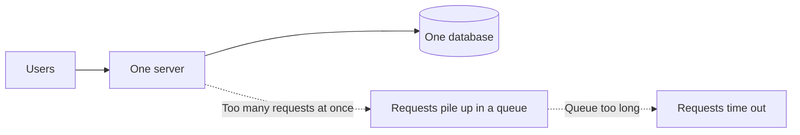

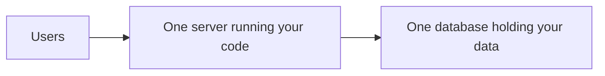

## Scaling: Vertical vs Horizontal

> Scaling up means expanding a setup. 
> 
> Vertical scaling buying big PC with big RAM and big processing memory and replace with old server. Same server box, just larger. Easy, expensive, tedious, single point of failure . 
> 
> Other way: horizontal scaling, attaching the same ordinary servers and splitting the task between them where each server has an identical copy of the app. As traffic increases, increase the servers. No single point of failure. 

**Two options for handling thousands of people at once.** You will pick between these two for real one day.

**Vertical scaling**

- **Get a bigger server.** More processing power, more memory. Same server box, just stronger and larger.
- **The right first move almost every time.**
  - Change nothing about your code.
  - Pay for a bigger machine, done for the afternoon.
  - If a bigger server fixes the problem, buy the bigger server and get back to work.
- **The number:** a $20/month server handles hundreds of requests a second for a typical app. That is millions of requests a day on one cheap box.
- **It runs out.** There is a biggest machine you can rent, and it gets very expensive long before you reach it.
- **A bigger box buys time, but not forever.**

**Horizontal scaling**

- **Stop making one box do all the work.** Run several ordinary servers and split the people between them. More machines sharing the load.
- **The servers are identical copies of your app.** Not different parts of the app. Not one for payments, one for messaging. The same code running three times. Each copy can handle any request on its own.
- **You ship once.** You tell the platform to run three instances of it. On Vercel, it quietly already does this for you.
- **This is the approach that actually keeps going.** Too much traffic next year? Just add more copies. There is no ceiling in the same way, because you are not depending on one machine being big enough.

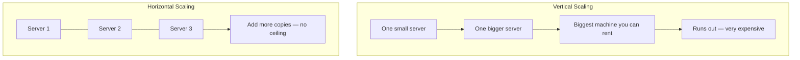

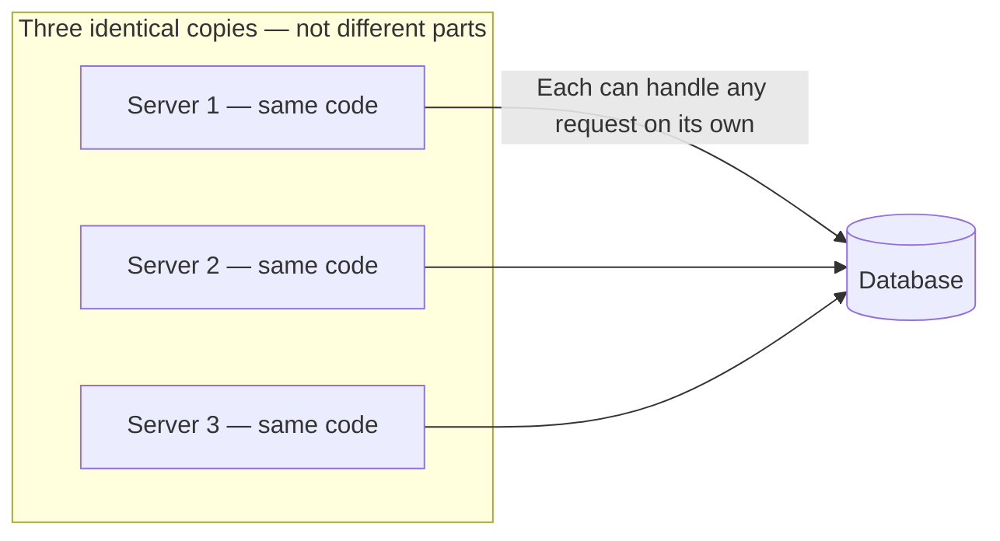

## Load Balancers

> LB handles allocation of multiple requests to each server if one server is busy, then it's sent to the different one. We can have multiple load balancers to not have a single point of failure. 
> 
> Nginx classic one Vercel Railway automatically have LBs. Now, interchangeability of each server is the next issue to solve. 

**The new question:** with more than one server, which server does a request go to? Something has to stand in front of your servers and hand each incoming request to one of them, spreading people out evenly so no single server gets overwhelmed while others sit idle.

- **That thing is called a load balancer.**
  - A request comes in, the load balancer picks a server, the server does the work.
  - If one server is busy, send the next request to a different one.
  - Add a fourth server next month, the load balancer starts using it.
  - Users never know how many servers there are or which one they got.
- **Nginx is a classic one.** On Vercel or Railway, you already have a load balancer. You just never had to set it up or think about it.

**The costs**

- **Single point of failure.** Everything flows through the load balancer. If it goes down, it doesn't matter that you have three healthy servers behind it, nobody can reach them. Real systems give the load balancer itself a backup. More stuff to run.
- **Servers must be interchangeable.** For the load balancer to send any request to any server, all servers have to be able to handle any request. Right now they are not. That is where sessions bite.

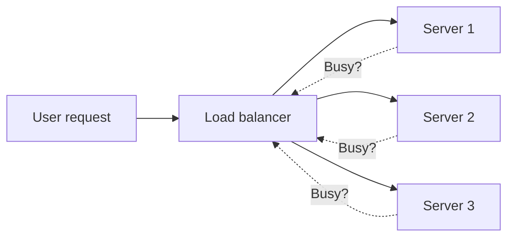

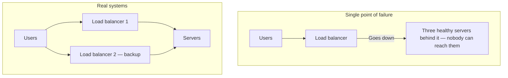

## Sessions and Stateless Servers

> Interchangeability of servers means: if a user logs in to server 1 and, due to a big load, the user goes to server 2, server 2 should be able to also handle the request instead of giving a "not authorised" bad request. 
> 
> If each server is handling the user session ID, then this won't be possible. 
> 
> Stateless servers are those servers which are not allowed to remember anything about you between requests in their own memory. They have to fetch it from separate shared storage "Redis" (or from db etc ways in case of JWT). They are interchangeable servers. 
> 
> Redis is a in-memory separate shared storage for containing user session IDs. Super Fast to Read from. Once a user's session is put in one write operation, the rest of the operations are just read operations where the server reads from Redis in a very, very fast time. But this leads to one more single point of failure and extra costing . 
> 
> Next issue comes from the demerits of having one database talking with all servers. 

**The problem**

- A user logs in on server A. They browse. They pick a ticket and hit buy. That request goes to server B. Server B immediately says: you're not logged in.
- Nothing is broken. This happens the moment you run more than one server and do not handle sessions properly.

**What being logged in means**

- The server checks your password, then needs to remember it is you on every request after that, so you are not retyping your password on every click.
- **The server makes a note:** "This person is logged in as Bob."
- **It hands you a session ID:** a random string that points at that note.
- Your browser sends the session ID with every request. The server looks at its note and knows it is you.
- **The question that matters: where does the server keep the note?**
- **By default, the note lives in the server's own memory.**
  - You log in, the load balancer sends that request to server one. Server one makes the note "Bob is logged in" in its memory.
  - A moment later you click something. The load balancer sends this request to server two. Server two has never heard of you, because the note is on server one.
  - Server two looks in its own memory, finds nothing, and asks you to log in again.
- **That is the random logout.** You are not being kicked out. You are being sent to a different server that doesn't have your note.
- **With three servers, roughly two out of every three clicks land on a server that doesn't know you.**
- **This is what "not interchangeable" meant.** Your login was stuck on a specific server.

**The fix: stateless servers**

- **The rule:** servers are not allowed to remember anything about you between requests. No server keeps a note in its own memory.
- **The note goes somewhere all of them can reach.** A separate place off to the side that every server can read from and write to.
- Now it doesn't matter which server you land on. You log in, the note gets written to the shared place. On the next click, whatever server the load balancer picks reads the same shared place, finds your note, and knows it is you.
- **A server that keeps nothing about you in its own memory is called stateless.**
- **Every server is now interchangeable**, exactly like the load balancer needed. Any server can handle any request, because none of them keep secrets the others cannot see.
- **The shared place is very often Redis.** An in-memory storage that is extremely fast to read from. That matters because you hit it on every request. Hold on to that name, it comes back later for a completely different job.

**The cost**

- **Every request now does one extra thing.** It reaches out to the shared store to find your note before it can do anything else. A little time added to every single request.
- **One more piece of infrastructure that has to be up.** If the shared store goes down, nobody can be logged in at all.

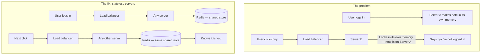

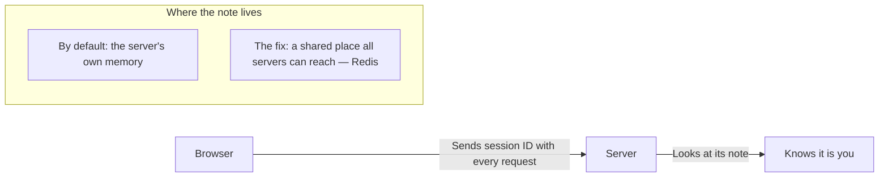

## Database Connections and Capacity

> Solid healthy system, no bug. Still slow because they all talk to one database. each database has less than 100-200 connections, where 10 to 20 connections are connected to each server. When servers stack up, they may exceed the database connection limit. And the database has a limited processing speed and memory. 
> 
> And in the case of serverless architecture, many times when no Instance is available. Each request leads to making a fresh copy of the instance, Surprisingly worsen in seconds spike, lead to not slowness, but direct connection errors as symptoms. 
>
> Solution to connection limits : connection pool, a small set of connections open at all times and everything shared between the servers. Instead of server opening and closing own connections, request borrows one connection from the set, use it and hand it straight back to the next request to use. Database only sees a fixed number of connections, no matter how many servers and requests you have. PGbouncer is common for Postgres. Now, major managed databases ship with Pooler inbuilt. 
>
> Solution to genuine capacity exceeded : - Refine database queries. - Use indexes. Instead of long row search - Have a balance of read and write queries.
>
> Final fix is to scale it up. 

**The front of the system is now solid:** load balancer, several stateless servers, everyone gets served no matter how many people show up. All of them talk to one database.

- **The app is slow again.** Every server is healthy. None at capacity. No bad queries. Nothing seems broken.
- **The thing all servers have in common:** they are talking to the same one database. We scaled the servers, but never scaled the thing behind them.
- **Two separate problems hide here.**

**Problem 1: connection limits**

- **A database will only hold so many open connections at the same time.** Each open line from a server to the database costs it memory and attention. There is a hard limit on how many it will accept at once, and it is lower than you would guess. Not millions. Often just a few hundred on smaller hosted plans, sometimes even a few dozen.
- **Count what is trying to connect.** Three servers, each opening several connections so it can handle several requests at once. That adds up fast.
- **Serverless makes it worse in a way that surprises people.** When a request comes in and there is no free instance ready, the platform spins up a fresh copy of your function. Each fresh copy opens its own new connection. A big spike means hundreds of copies appearing at once, each grabbing connections. They fill every slot in seconds.
- **The tell:** the symptom is not slowness, it is errors. The ticket app was completely fine, a popular show went on sale, traffic spiked, and suddenly database connection errors right at the moment things were going well.

**The fix: a connection pool**

- **The idea:** instead of every server opening and closing its own connections whenever it likes, keep a small fixed set of connections open at all times and everything shares them.
- A request borrows one from the set, uses it, and hands it straight back for the next request to use.
- **The database only ever sees that small fixed number of connections**, no matter how many servers or requests you have. You stopped overwhelming it with the sheer number of open lines.
- **PgBouncer is a common one for Postgres.** Most managed databases now ship a pooler you can just switch on.
- **This fixes the errors, but not the other problem.**

**Problem 2: genuine capacity**

- The connections are under control and the database is still maxed out. It is genuinely doing more work than one machine can do.
- **First, a quick check: are your common queries actually using indexes?**
  - If the app looks users up by email on every login and there is no index on the email column, the database is scanning every row to find one person every single time.
  - That one missing index looks exactly like a capacity problem, which it is not.
  - Add the index and the load can just disappear. Check that one first, it is free.
- **Say the indexes are there. The database is simply out of room.**
- **Look at what it is spending all of its efforts on.**
  - Any social app: you open it and scroll. You read post after post after post. Once in a while you write something, a post, a like, a comment. For every one thing you write, you read hundreds of things.
  - TikTok: you are reading videos, scrolling through different content served to you.
  - **Reads massively outnumber writes.** The database is spending nearly all of its efforts answering the reads.
  - **If you could somehow take the reading load off it, you would fix nearly all of the problem.**

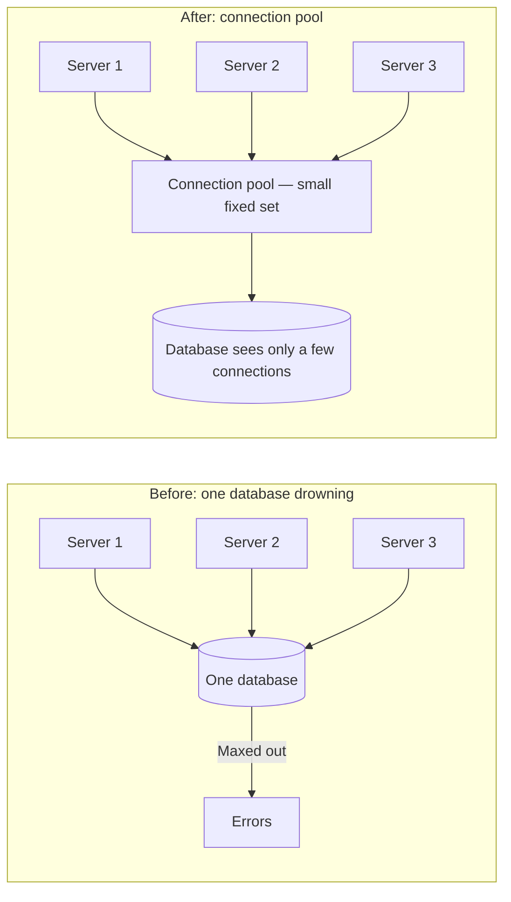

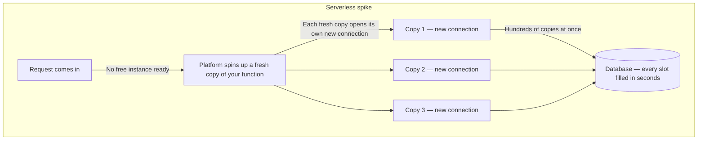

## Read Replicas

> In reality, there is always a write-to-read ratio of 1:200 to 1:400, where, for every 1 write, there are around 200 to 400 reads. Then the database spends 99% of its time on reads and 1% on writes. 
> 
> Fix for read processing 99% of DB : read replicas. Read-only copies of master DB. Each write will be handled by the master DB. And each read replica will handle the read queries. 99% load to 33% 33% 33%(3 Read replicas) and master db has 1% write only. At each update in master DB , read replicas get automatically updated. 
>
> This adds up to two costs: 1. Money 2. Replication lag(the window where copy is behind primary/master, made the application a little wrong, some users will see outdated data/lag)
>
> Now, replication lag is normal for other people viewing other posts. But you're saying your own posts lag feels broken. To solve that, you see your data from read query from the master/primary DB. 
>
> The real lesson: you have to find a balance between features and trade-offs(selective problems). 

**The fix: make copies of the database.**

- **One database stays the primary.** The only one you are allowed to write to. Everything you add or change goes there.
- **The copies are read only.** You cannot write to them, but you can read from them all day.
- **Whenever something changes on the primary, it sends that change out to the copies** so they stay up to date.
- **These copies are called read replicas.**
- **Now the work is spread out.** Writes go to the primary. Reads, the huge majority of your traffic, get shared across the replicas. Each machine is doing a fraction of what one machine was drowning under.

**The cost: replication lag**

- **This cost is different from the others.** It doesn't just cost money or a moving part. It quietly makes your app a little wrong.
- When you write something to the primary, it takes a moment, usually tiny but not zero, for that change to reach the copies.
- **The example:** you post something. That write goes to the primary. Immediately your app loads your feed and that read goes to a replica. The replica has not yet received your new post. You look at your own feed right after posting and your post isn't there. You refresh, and then it is there.
- **Nothing was broken.** The copy was just a half second behind.
- **That gap has a name: replication lag.** It is the price of read replicas. Your data is now slightly out of date on copies, for a moment, sometimes.
- **Usually completely fine.** Somebody seeing a post half a second late doesn't matter.
- **Sometimes it does matter.** You seeing your own post missing feels broken.
- **For those specific cases, apps deliberately read from the primary instead of a replica.**
- **The real lesson:** you just made your app faster and slightly wrong on purpose. You chose which parts are allowed to be slightly wrong and which parts are not.

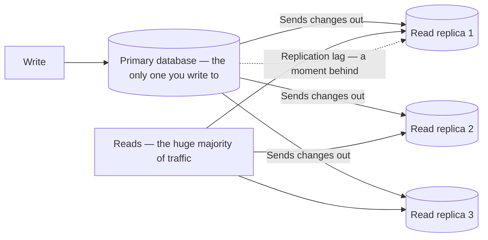

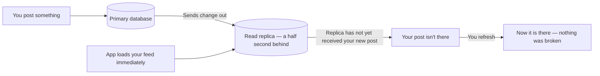

## Caching

> Suppose a trending feed which is read by millions of users. 1000000 same read operation WASTE = 1 read operation. Example: for follower count , in every second, counting millions of followers of an influencer page is wasteful . 
>
> Solution : Caching, Compute it once and keep the answer somewhere fast. The next person who asks gets the saved answer. The database is never touched. If a query is found in the cache, then it reads only the cache, If not existing in cache, then read from the database, return to the user, and also copy to the cache. Drastically faster 250 ms to 1 ms, as caching takes an 80%+ hits . Redis handles caching too. Caching trade-off between correctness and speed .
>
> Even though caching leads to data lag from DB, still, you can have a way of refresh(cache invalidation) every 5-second / 30-second / 5-minute /etc. Have a balance that: more the refreshing time, less the DB load. Less the refreshing time, more the DB load. (Hard task among engineers, subjective). For example, you can have caching in social media applications, but never in banking(because there incorrectness is scary). 
>
> Coding is dead : You can outsource the typing of code stuff like Redis calls, key naming, technology, syntax from AI. Engineering is in Goldern Period: But it is your decision-making What May be stable, and for how long, and what may never be , what do users expect and what users accept , that is the thing that AI cannot give, and this makes you irreplaceable. 

**Some reads are still expensive.** There is one particular kind of question asked over and over, thousands of times, that gets almost the same answer every time. Computing the same answer thousands of times is just wasteful.

**The example: follower count**

- To get it, the database has to count every follower record for that person.
- Someone with 2 million followers means the database counting through 2 million rows to produce one number.
- That number is on their profile. Every single person who opens that profile makes the database count all 2 million again. Thousands of times an hour, the same expensive count, for a number that barely moves.
- **The database does hard work over and over to get the answer we already had a second ago.**

**The fix: a cache**

- **Compute it once and keep the answer somewhere fast.** The next person who asks gets the saved answer. The database is never touched.
- **That saved answer, kept somewhere fast and close, is a cache.**
- **The flow:**
  - A request comes in asking for the follower count.
  - First check the cache. Is the answer already sitting there?
  - If yes, hand it straight back. Never go near the database.
  - If no, ask the database, get the number, and put it in the cache on the way back. The next person gets it for free.
- **A cache is fast in a way a database cannot be** because it keeps its data in memory rather than reading from disk. The answer comes back in a fraction of the time.
- **This is very often Redis.** The same Redis from the sessions section. Same piece of tech doing a second job. You didn't add a whole new system to your stack. The thing you already ran for sessions can hold your cache too.

**The cost: staleness**

- **Caching has the sharpest cost in this whole video.** The moment you save a copy of an answer, that copy can go out of date.
- **The example:** someone gets a new follower. The real count in the database is now one higher, but the cache is still holding the old number. Everyone opening that profile sees the old count until the cache is updated or thrown away.
- **Your follower count is now sometimes a little wrong.** Deciding when to throw away that saved answer, so it doesn't stay wrong for too long, is genuinely one of the harder problems in the whole field.
- **The old joke among engineers:** the two hardest things in computing are naming things and knowing when to clear your cache.

**The real skill**

- **Caching trades correctness for speed on purpose.** You have to decide which pieces of your app are allowed to be a little wrong for a little while, and which are not.
- **A follower count that is 30 seconds out of date:** nobody will ever notice, nobody is harmed. Cache it hard.
- **The balance in somebody's bank account:** can never be even slightly out of date. You do not cache that, ever.
- **That decision is not a coding decision.** AI will happily write that caching code for you, and write it well. What it will not do is make the best call, because that call is not about code. It is about your product, your users, and what they will and will not accept.
- **It needs someone who understands the whole system and the people using it.** That is the part of the job that isn't going anywhere. You can outsource the typing, but not the decision-making.

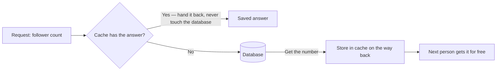

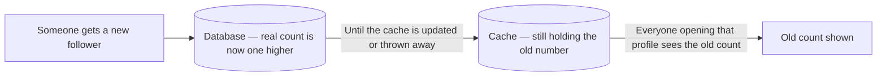

## Queues and Workers

> 

**One more kind of slow.** It is a strange one, because it has nothing to do with reading the data at all.

**The problem: the signup flow**

- A user fills out the form, clicks sign up, and expects the account to be created right away.
- Creating the account might not be the only thing the server has to do. It might also need to send a verification email, track the signup in analytics, or set up some initial data for the new account.
- **If you do all of that before sending the response, the user just sits there staring at a loading spinner**, waiting for everything to finish.
- **Sending the verification email is not something your server does itself.** It hands the email to an outside service and waits for that service to say "sent."
- **Your signup is now only as fast as that email service.** If it is having a slow day, your signup is slow today. If it is down, your signup fails too. The account couldn't be created because the verification email couldn't be sent.
- **You have tied whether someone can even join your app to whether some separate email company happens to be up right now.** That is a bad thing to tie together.
- **You have already seen this, you just didn't know it.** When you sign up for something and the verification email takes a few seconds to land, or you upload a video and it says "processing" and lets you carry on. The delay is not the app being slow. It is the app being built correctly.

**The fix: split the work**

- **Creating the account is the only part the user actually needs to happen before you answer.** The verification email doesn't have to happen in that same moment. It just has to happen soon.
- **The instant the account is created, answer the user.** "Done. You're signed up."
- **For the email, write down a note:** "Send a verification email to this person." Drop it onto a list.
- **That list is called a queue.** It is just a line of jobs waiting to be done in order.
- **A separate process picks up the note and sends the email** a moment later, while the user is already happily looking at their logged-in homepage.
- **That separate process is called a worker.**
  - The server's job: answer the user fast, drop the slow work onto the queue.
  - The worker's job: quietly chew through that work in the background.
- **It isn't just verification emails.** Password resets, notifications, receipts, any slow job you do not want a user waiting on. All of it goes on the same queue and the worker handles it in the background.
- **For a lot of apps, this is a tool called BullMQ.** It runs on Redis, the same Redis you already have for sessions and your cache. Three jobs now in a single piece of technology.

**The win and the costs**

- **The signup becomes instant.** It no longer cares whether the email service is even up. If it is down, the note just waits in the queue until it comes back up. The account was already created either way.
- **Cost 1: the work now happens later.** That is exactly why the verification email takes a few seconds to show up. For a verification email, nobody cares. You just need to know that "done now" means "we have promised to do this," not "this is finished."
- **Cost 2: two more things to run.** You have to keep both the queue and the worker alive.
- **Cost 3: jobs can fail.** The worker tries to send the email and the email service is down. You need to plan for that: try again in a minute, and if it keeps failing, put it somewhere so a human can look at it later. A job you dropped on a queue and never checked on is a job you are quietly not doing.

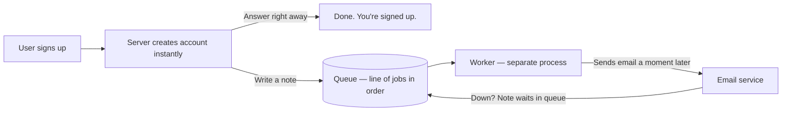

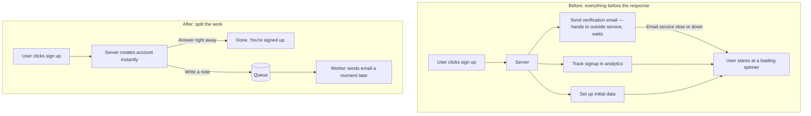

## Sharding

**Everything fixed so far was about handling more people. This last one isn't about people. It is about how much data you have.**

- **Remember the read replicas?** Each one is a full copy of your database. That quietly assumes your whole database fits on one machine in the first place.
- **What if it does not?** The data just keeps growing until it is too big for any single machine to hold. A copy cannot save you now, because there is no machine big enough to copy it onto.
- **The fix: stop keeping all your data in one place.** Split it across several databases. Each one holds only a part of it.

**The problem: which database?**

- If data is spread across three databases, how does the app know which one to put a new user in? Later, how does it know which one to find them in again?
- **You cannot just drop them anywhere.** Save a user randomly and you would have to search all three databases every time to find them. That is slower than the one database you started with.
- **You need a rule.** Pick one column, something that every record has. For users, the obvious choice is the user ID. Use that ID to decide which database they go on.

**The rule**

- **Take the user ID and divide it by the number of databases you have. The remainder tells you where they go.**
- With three databases, divide by three:
  - Remainder 0 → database 1
  - Remainder 1 → database 2
  - Remainder 2 → database 3
- **Users are spread evenly across all three.** Each database holds roughly a third of them. No single machine has to hold everyone anymore.
- **If your IDs have letters in them, like a UUID:** first run them through a hash function, which turns any value into a number, the same number every time. Then the exact same divide-by-remainder rule applies.

```
shard = user_id % number_of_databases
```

- **Each of these databases is called a shard.** Splitting your database across shards by a rule is called sharding.

**Why it works**

- **Watch a request come in for user number 5.** The app runs the same exact rule. 5 / 3, remainder 2, which is database 3. It goes straight there. It doesn't search. It doesn't check the other two. It just knows.
- **The rule is consistent.** The same user always lands on the same shard. Writing data and finding it again both use the same rule. One shard every time.
- **You have essentially split your lookup time, your reading time, and your writing time by three.**

**The cost: cross-shard queries**

- **As long as a question is about one user, it is fine.** One shard, you get it fast.
- **Some questions are not about one user.** Say you want to count how many users you have in total. There is no single shard that knows the answer, because no shard has all the users. You have to ask all three, get their separate counts, and add them up yourself.
- **A question that used to be one simple query is now three queries and some additional assembly.**
- **It gets worse the more shards you have.** 10 shards means asking 10 databases and combining 10 answers.
- **Anything that has to look across all your data** (counting, sorting everything by date, searching everyone) now has to touch every shard.
- **These are called cross-shard queries.** Avoiding them is the whole art of sharding.
- **That is why choosing the rule, which column you split on, is such a big decision.** Pick well and almost every query stays on one shard. Pick badly and all your common queries will have to hit every machine. You have built something slower than what you initially started with.
- **Going back is its own painful migration.** Once your data is split like this and all your code is written around it.
- **This is the most powerful tool in the whole video, and still the one you reach for last by a long way.** Teams put it off for years, and they are right to. You do it only when the data simply will not fit any other way.
- **Doing it for real on a live app with millions of people already using it is a different level of hard.** The migration alone, moving all that data onto shards without taking the app down, is a serious story. **Notion did this.** They went from one database to sharded at over 200 billion rows while the whole product stayed alive.

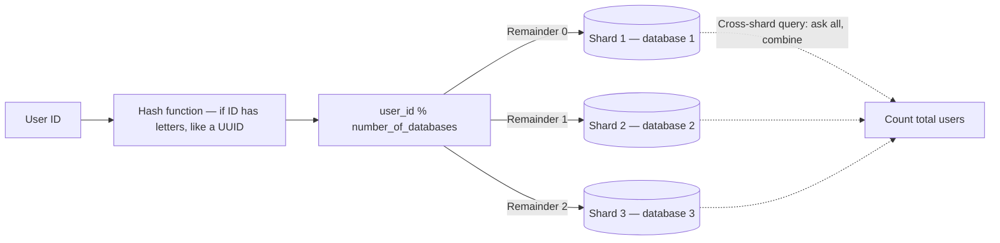

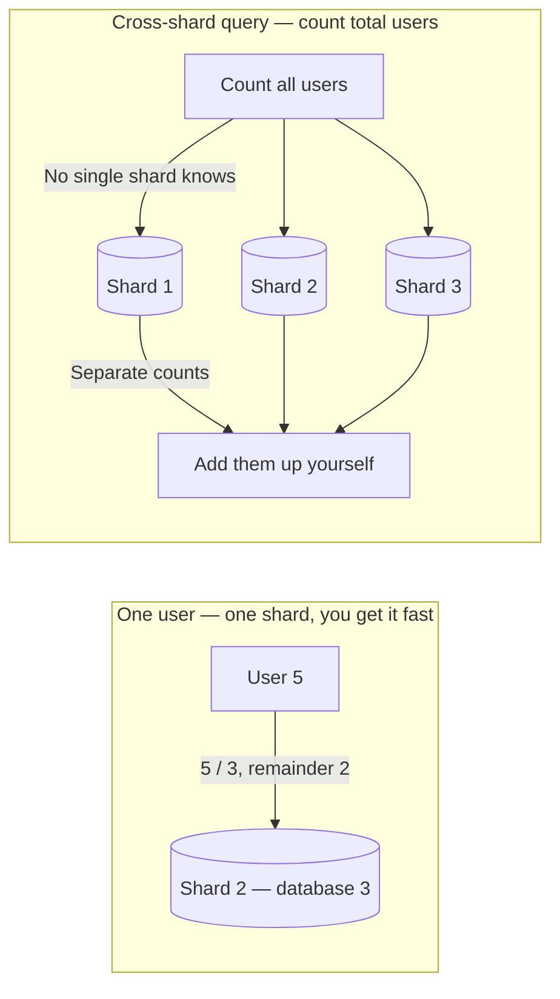

## The Full System and the Real Skill

**What we built, in order:**

- Started with one server and one database.
- More people showed up than one server could handle. Added servers and a load balancer in front of them.
- The servers could not remember who was logged in. Moved sessions to a shared store.
- They were all hitting one database. Pooled the connections and split reads across the replicas.
- The same expensive answers were being computed over and over again. Cached them.
- Slow work was making users wait. Moved it to a queue for a worker to handle in the background.

**That is a real system.** It is genuinely how a huge number of apps are built.

- **AI can build every one of these boxes for you.** Knowing which ones you actually need, and what they cost, is the part that it cannot. That is the job now.
- **For job interviews:** anyone can name these things. The one who gets hired says why they would pick one over the other, and what it costs.
- **That is system design.** Not the boxes, but the order and the trades we make.

```mermaid
flowchart LR
    U[Users] --> LB[Load balancer]
    LB --> S1[Stateless server 1]
    LB --> S2[Stateless server 2]
    LB --> S3[Stateless server 3]
    S1 --> R[(Redis — sessions + cache)]
    S2 --> R
    S3 --> R
    S1 --> P[(Primary database)]
    S2 --> P
    S3 --> P
    P --> RR1[(Read replica 1)]
    P --> RR2[(Read replica 2)]
    S1 --> C[(Cache)]
    S2 --> C
    S3 --> C
    S1 --> Q[(Queue)]
    S2 --> Q
    S3 --> Q
    Q --> W[Worker]
    W --> ES[Email service]
```

```mermaid
flowchart TD
    A["1. One server + one database"] --> B["2. Add servers + load balancer"]
    B --> C["3. Move sessions to a shared store"]
    C --> D["4. Pool connections + split reads across replicas"]
    D --> E["5. Cache expensive answers"]
    E --> F["6. Move slow work to a queue for a worker"]
    F --> G["7. Shard when data will not fit any other way"]
```
